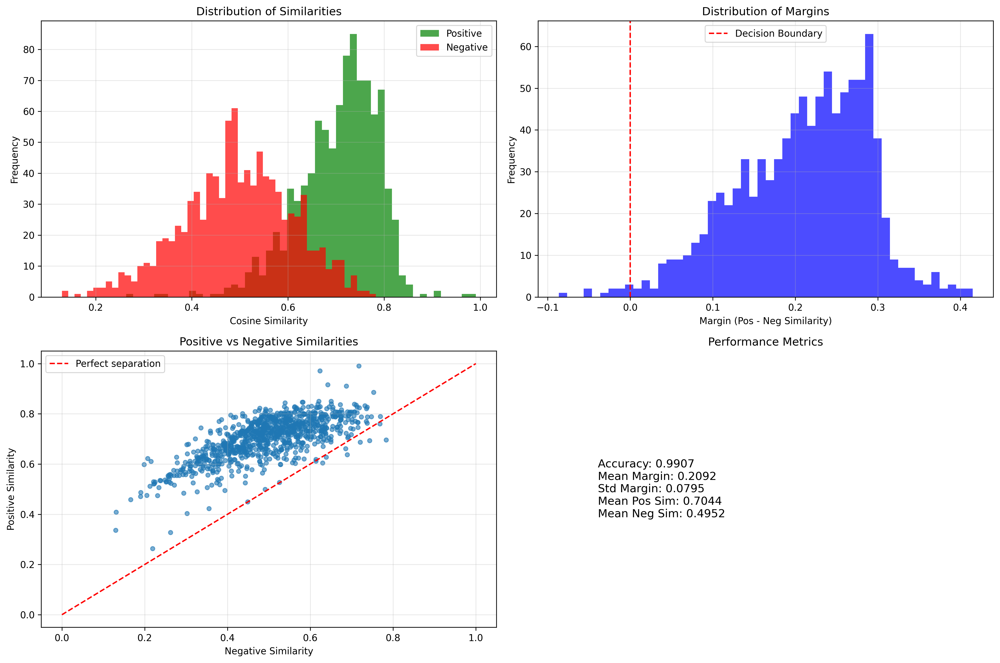

# semantic-search-rDepression

This repository contains my personal implementation of a semantic search system using FAISS, trained on [a Kaggle 
 dataset of approximately 32,000 Reddit posts from r/depression, collected over a three-month period in 2019.](https://www.kaggle.com/datasets/luizfmatos/reddit-english-depression-related-submissions) While many of these posts are now deleted, the dataset was ideal for local training on my RTX 3080 (10 GB VRAM).

## What does the model do?

The idea is simple: you type out what you're feeling, whether it's to vent or to make sense of what's going on internally and instead of posting it publicly, the model tries to find similar posts from the dataset.

Sometimes, just seeing that someone else has felt the same way can make a difference. The model returns the top 3 most semantically similar posts, along with their original Reddit URLs. If the post still exists, you can visit it and read the discussions and comments of others who've been through something similar.

## Example Output

### **Query:**
`i cant eat`

### Top 3 Similar Posts:

#### Similar Post 1 (Similarity: 0.9772)
Text: why is it so hard to eat? i literally can't get myself to do it i'm hungry i'm not trying to lose weight or anything i don't have ED but i just can't get the motivation to eat even if it's right in fr...  
URL: https://www.reddit.com/r/depression/comments/kjsglw/why_is_it_so_hard_to_eat/

#### Similar Post 2 (Similarity: 0.9146)
Text: No-one to talk to and how am I supposed to eat? I'm starving, I have money and food but I can't stomach it and i'm feeling weak and sick lately from not eating. What am I supposed to do? I'll snack a bi...  
URL: https://www.reddit.com/r/depression/comments/2efn4z/noone_to_talk_to_and_how_am_i_suppose_to_eat/

#### Similar Post 3 (Similarity: 0.8786)
Text: I won't eat and I refuse I recently lost all my friends just to a fight and people just use me as a doormat i haven't ate in 1 week and drank a little bit of juice all together. I can't walk around my ...  
URL: https://www.reddit.com/r/depression/comments/rgik5/i_wont_eat_and_i_refuse/

> Clicking on a URL will take you to the full discussion on Reddit, provided the post hasn't been deleted.

## Motivation

This project started as a personal mini-project during my journey through the Hugging Face LLM course. It's both a learning experiment and a documentation of my exploration into semantic search and transformer-based models.

## Technologies and Learning Journey

This project was a deep dive into building a semantic search model with Hugging Face's `transformers` and SBERT's `sentence-transformers`, using the lightweight yet high-performing `all-MiniLM-L6-v2`.

### Key concepts and techniques I explored:

- **Triplet Loss** using (anchor, positive, negative) training samples, inspired by contrastive loss and k-NN logic.
- **Triplet Mining**: Implemented semi-hard mining with a margin of `0.3`. (Might experiment with hard mining later.)
- **Zero-shot Labeling**: Generated positive/negative pairs using the model itself, instead of random sampling, to improve relevance.
- **Custom Training Loop**: Built with Hugging Face's `accelerate` for distributed training and memory optimization.
- **Memory Management**:
  - Gradient accumulation
  - Shared forward passes for triplets
  - Mixed precision training (`torch.amp.autocast`)
  - Manual garbage collection
- **Model Checkpointing**: Best model is saved/exported for inference or for retraining.
- **Preprocessing**: Improved Pandas proficiency during dataset cleaning and formatting.
- **Evaluation**:
  - Created a custom loop with metrics like MRR and Recall@5.
  - MRR tracks how quickly the right result shows up.
  - Recall@5 shows how many relevant results appear in the top 5.
- **Embedding Generation & FAISS Indexing**: After training, generated embeddings for the entire dataset using the best model checkpoint and built a FAISS index for efficient similarity search.
- **Interactive CLI**: Includes a command-line interface to test inputs and return similar posts using `argparse`.

## Training Setup & Hyperparameters

- **Loss Function**: `PyTorch built-in TripletMarginLoss` (margin = `1.0`)
- **Optimizer**: `AdamW` (learning rate = `2e-5`)
- **Scheduler**: `Cosine` with 5% warmup
- **Epochs**: 3
- **Effective Batch Size**: 32 (8 per step with 4-step accumulation)
- **Monitoring**:
  - `eval_steps = 500` 

## Results

### Final Epoch (Epoch 3):

- **Train Loss**: 0.4466 | **Train Accuracy**: 95.00%
- **Val Loss**: 0.4358 | **Val Accuracy**: 94.59%

### Test Set Evaluation:

- **Test Accuracy**: 99.07%
- **Mean Positive Similarity**: 0.7044
- **Mean Negative Similarity**: 0.4952
- **Mean Margin**: 0.2092
- **Std Dev Margin**: 0.0795
- **Correct**: 956/965
- **Incorrect**: 9
- **Challenging Cases (margin < 0.1)**: 90/965 (9.33%)

- **MRR**: 0.9855
- **Recall@5**: 1.0000
> **Note:** Accuracy is very high because it's very easy to label positive data, but in reality similarity score is what is important. Plus the test dataset is quite small only 3% (~930 posts) 

### Visualizations

> The plot above shows the distribution of positive and negative similarities from the test results.

## Future Improvements / TODO

- Push the full model to HuggingFace for inference use.
- Build a live demo with Gradio
- Export the model to ONNX and apply quantization for optimization
- Implement content filtering and safety measures for edge cases where retrieved posts might contain particularly concerning content (self-harm references, crisis situations)

---

Feedback, corrections, and suggestions are always welcome!